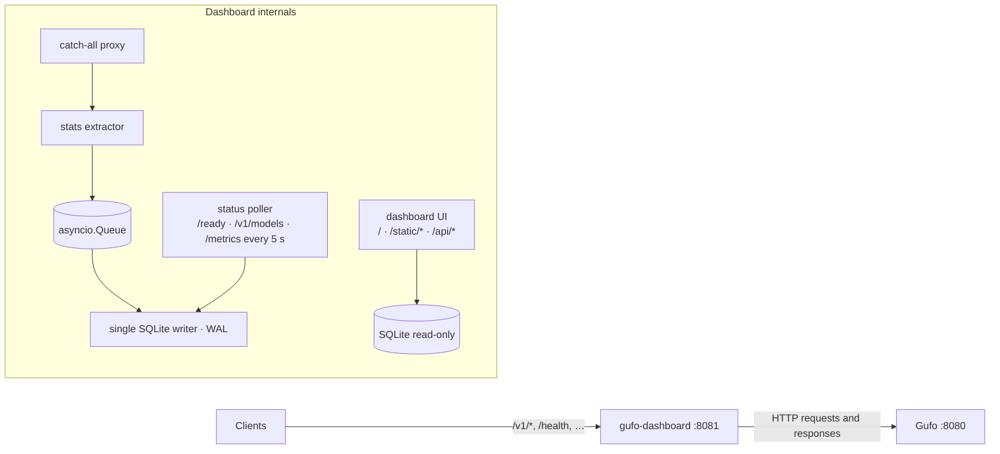

# Architecture

- The dashboard owns only `/`, `/static/*` and `/api/*`. **Everything else**
  (any method, including `OPTIONS`) is routed to Gufo. See the forwarding rules below.
- Recorded as requests: `POST /v1/chat/completions`, `/v1/completions`,
  `/v1/responses`, `/v1/messages`, `/completion`.
- Streams are forwarded as they arrive; an SSE parser inspects a side copy.
- Statistics are inspected alongside forwarding; completed records are queued
  for a single writer task. Database writes run outside the response path.

Opt-in `content.py` captures bounded, allowlisted user and assistant text beside
extraction. The writer stores it in `request_content` with the matching request
ID; content has its own retention window and never enters daily rollups.

Code layout: `app/main.py` (wiring, dispatcher, logging), `proxy.py`,
`sse.py`, `extract.py`, `content.py` (text capture), `db.py` (schema, writer, rollup), `stats.py`
(aggregations), `poller.py`, `prom.py`, `api.py`, `static/` (no build step).

## Forwarding rules

The proxy preserves response status, application headers, and response body
bytes, subject to these exceptions:

- Hop-by-hop headers and headers named by `Connection` are removed.
- The upstream host and request content length are recomputed. Upstream requests
  use `Accept-Encoding: identity` so response statistics can be inspected.
- For streamed chat and completion requests without `include_usage: true`, the
  proxy adds that option and filters the extra usage event out of the response.
  This reserializes the request JSON and can buffer until an SSE event ends.
- Client credentials are forwarded. `GUFO_API_KEY` is used only by the poller.
- Redirects are returned to the client rather than followed.
- Upstream connection failures produce a local `502` JSON error. Failures after
  response headers have been sent can end the stream; they cannot change its status.

Request bodies are buffered in memory before forwarding. Ordinary response
chunks are streamed; non-streaming responses are copied for extraction up to
64 MiB. SSE inspection stops after an event exceeds 16 MiB. These inspection
limits do not impose a request-size limit.

## Storage and lifecycle

SQLite uses WAL mode. A bounded queue feeds a single writer task, which writes
batches in a worker thread. Each request row updates its daily rollup in the same
savepoint, along with its optional content record. API queries use separate read-only connections. There is no migration
framework; the current schema version is 2. Initialization adds the content
table to version-1 databases without changing existing statistics.

Queue overflow drops statistics rather than blocking inference responses.
`/api/status` exposes queue size, dropped records, extraction failures, and write
failures. These process counters reset when the dashboard restarts.

Retention runs at startup and hourly. It removes old request rows, events, and
metric snapshots; daily rollups remain. Captured text has a separate seven-day
default window and an 8 MiB queued-text budget. Content APIs enforce expiration
before hourly pruning; deleting a parent request removes its content record.
Bulk content clearing retains metrics and suppresses content from requests
already in flight. Capture-off mode records a disabled status without text. Shutdown stops polling and drains the
queue for `SHUTDOWN_DRAIN_TIMEOUT` seconds before closing connections.

Run one application process per database. In-flight tracking, polling baselines,
and queue counters are process-local; multiple workers are not coordinated.
